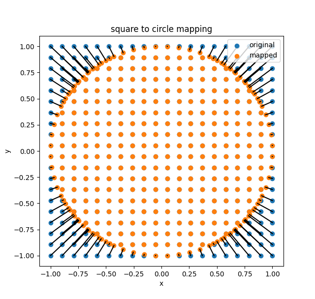

# Installation of command line tools
Install `arduino-cli`


# Compile and upload project
From the root folder of the project, run the following commands:
```bash
arduino-cli compile --fqbn arduino:avr:uno .
arduino-cli upload --port /dev/tty.usbmodem1101 --fqbn arduino:avr:uno .
```

To use a different folder for the build files, use the `--output-dir` and `input-dir` flags
```bash
arduino-cli compile --fqbn arduino:avr:uno . --output-dir build
arduino-cli upload --port /dev/tty.usbmodem1101 --fqbn arduino:avr:uno .  --input-dir build
```

To use the src library. use the --library flag
```bash
--library ./src
```
such as, to build the remote_controller project:
```bash
arduino-cli compile --fqbn arduino:avr:uno --library ./src remote_controller --output-dir remote_controller/build
arduino-cli upload --port /dev/cu.usbmodem1101 --fqbn arduino:avr:uno remote_controller  --input-dir remote_controller/build
```
## Connections
Vin and GND are shared by all components.

### Battery
The battery is connected to the arduino as follows:
| Battery | Arduino |
|---------|---------|
| GND     | GND     |
| VCC     | Vin     |

### Joystick
The joystick is connected to the arduino as follows:
| Joystick | Arduino |
|----------|---------|
| GND      | GND     |
| VCC      | 5V      |
| VRX      | A1      |
| VRY      | A0      |
| [SW]       | [D2]      |

### Motor controller
The motor controller is connected to the arduino as follows:
| Motor controller | Arduino |
|------------------|---------|
| GND              | GND     |
| VMS              | Vin      |  
| ENA              | D10     |
| IN1              | D6      |
| IN2              | D7      |
| ENB              | D11     |
| IN3              | D8      |
| IN4              | D9      |

## Code stuff
In the joystick class, the map square to circle function represents the following mapping:




## Useful resources
Use `arduino-cli`: [tutorial](https://www.devdungeon.com/content/arduino-cli-tutorial)

Wireless module [github](https://github.com/WhaddaMakers/Long-range-433MHz-RF-wireless-module-set)

Potentially interesting way of sending structured data through wifi, not working afaik [link](https://forum.arduino.cc/t/sending-multiple-integers-and-floats-through-wireless-rf22/256567/2)

### arcuino-cli useful commands
#### list boards and ports
```bash
arduino-cli board list
```
#### compile
```bash
arduino-cli compile --fqbn arduino:avr:uno file.ino
```
#### upload
```bash
arduino-cli upload --port /dev/tty.usbmodem1101 --fqbn arduino:avr:uno file.ino
```
The files need to include a file that has the same name as the root folder to be compiled correctly by the arduino-cli. For example, if the root folder is called `project_name`, then the file `project_name.ino` needs to be included in the root folder,

